# часть 1

## 2
Базовые понятия - в гите есть репозиторий. репозиторий это весь проект со всеми файлами. в репозиториях есть ветки, например есть главная ветка(main), которая например выгружается на хостинги, а есть ветки который содают разработчики для разработки - каждый под себя и свою задачу создает. Ветки состоят из коммитов - то есть изменений которые мы считаем логически завершенными и которые мы хотим добавить в текущюу ветку, а потом и вовсе в главную ветку, откуда код дойдет до пользователя(например пользователь сайта). Коммиты состоят из изменений - какие они бывают? Добавлен/удален файл/папка изменен/добавлена/удалена строчка

создадим локально репозиторий. локально значит репозиторий кроме твоего компьютера никто не увидит 

`git init`

создадим файлы ( это стандартная команда командной строки )

`touch file.py`

`touch file.cpp`

добавим ИЗМЕНЕНИЯ произведенные с файлами file.py file.cpp. в нашем случае эти изменения - это добавление файла

`git add file.py file.cpp`

## 3

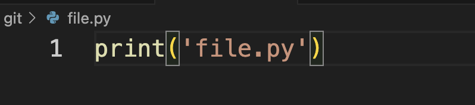

## 4 
Проиндексировано изменение или нет - значит будет ли учитывать git это изменение при создании коммита. Коммит создается из всех проиндексированных изменений

посмотрим что изменение не проиндексирован 

`git status `

проиндексируем это изменение
`git add file.py`

убедимся что статус поменялся

`git status`

## 5 

`git commit -m "My first commit"`

## 6

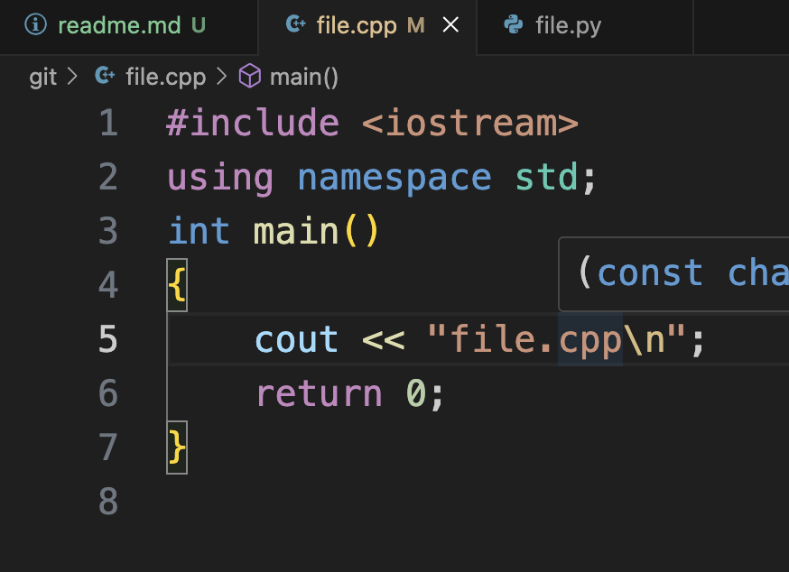

`git add file.cpp`

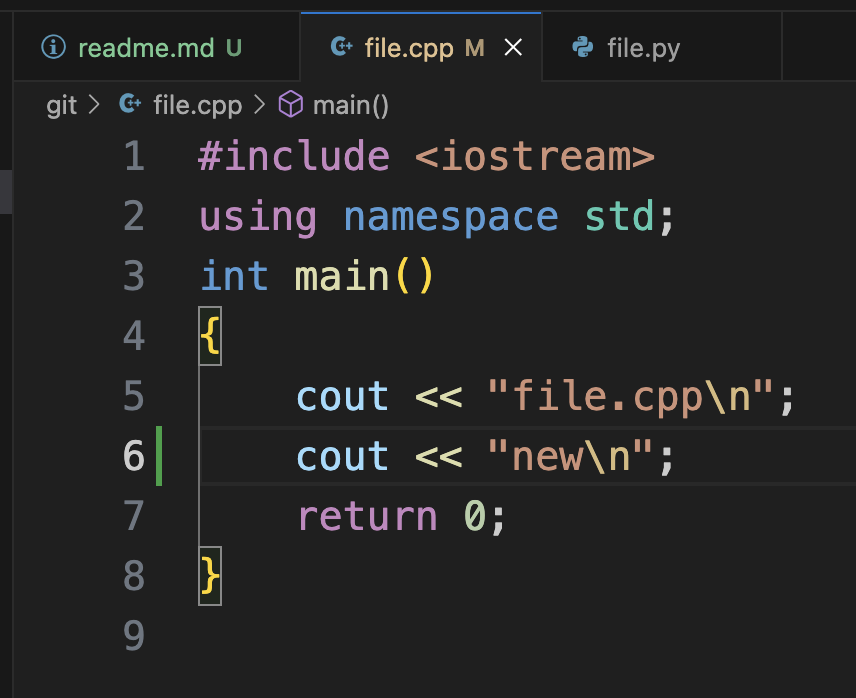 - видим зелененькое. это значит была добавлена строчка. Проверим через git status

`git status`

видим  

Changes to be committed: modified:   file.cpp 

и 

Changes not staged for commit: modified:   file.cpp

Это значит первое изменение проиндексировано и готово к коммиту, а второе не проиндексировано - сделаем коммит и увидим что второе изменение не попало в него

`git commit -m "Change file.cpp"`

Добавим второе изменение в индекс

`git add file.cpp`

`git status`

видим Changes to be committed: file.cpp - можно коммитить второе изменение

`git commit -m "Change file.cpp new"`

## 7

`git log --oneline --all`

видим 
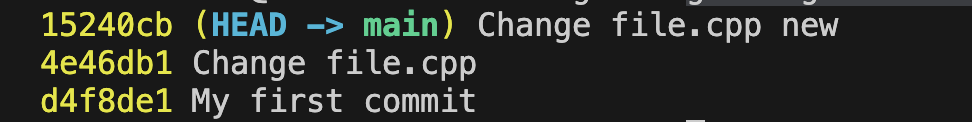

## 8
`git checkout 4e46db1`

4e46db1 это хэш второго коммита (Change file.cpp) - у тебя он будет другим

сделаем git log 

`git log --oneline --all`

видим что мы(head) теперь на коммите Change file.cpp, можно посмотреть file.cpp и убедиться что изменений из коммита Change file.cpp new теперь нет, но гит про этот коммит все помнит - какой умный

## 9
теги нужны чтобы проименовать этапы разработки (я не пользуюсь таким)

`git tag v1-test`

`git tag`

`git log --oneline --all`

видим (HEAD, tag: v1-test) Change file.cpp

## 10
вернемся на коммит Change file.cpp new

`git switch main`

изменим файл, но не проиндексируем

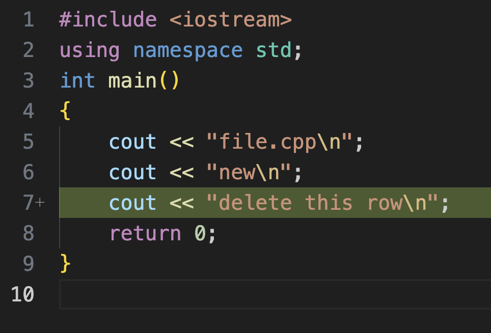
проверим изменение в 

`git status`

уберем это изменение и видим что это сработало

`git restore file.cpp`

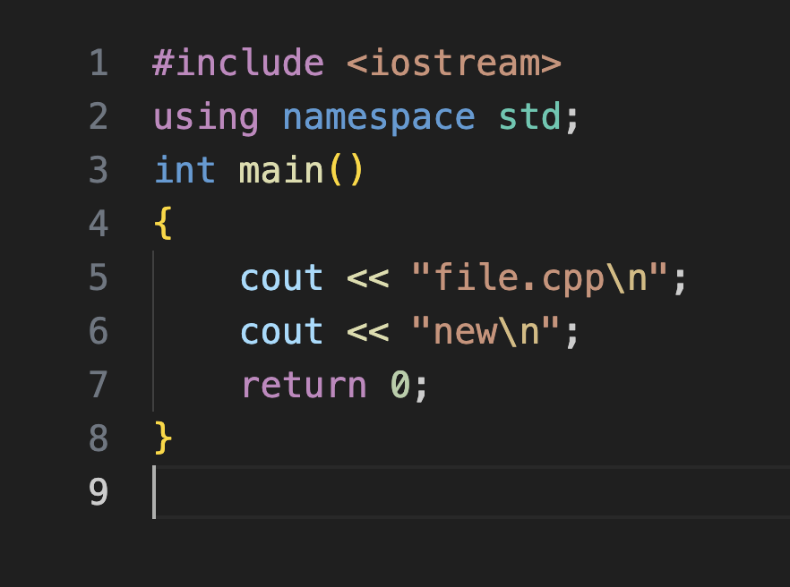

Чтобы убрать изменения после индексации сначала нужно убрать изменения из индексации командой git restore --staged file.cpp а после выполнить уже знакомую команду git restore file.cpp

Пример

`git status`

`git add file.cpp`

`git restore --staged file.cpp`

`git restore file.cpp`

## 10
коммит можно отменять, а можно и удалить. удалить хуже так как мы безвозвратно потеряем изменнеия, но зато можно сделать реверт-коммит, который бдует содержать обратные изменения в сравнение с нежуным коммитом(если в коммите добавили строку, то в реверт коммите строку убираем - это сделает автоматика)

пример

`git log --oneline `

ищем хэш коммита Change file.cpp new

`git revert 15240cb`

теперь посмотрим в логе что у нас новый коммит появился

`git log --oneline`

видим Revert "Change file.cpp new"

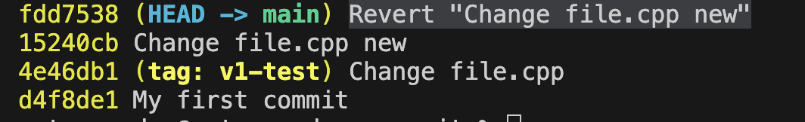

# Часть 2

## 2

не понял что значит согласно врианту

нахожим new
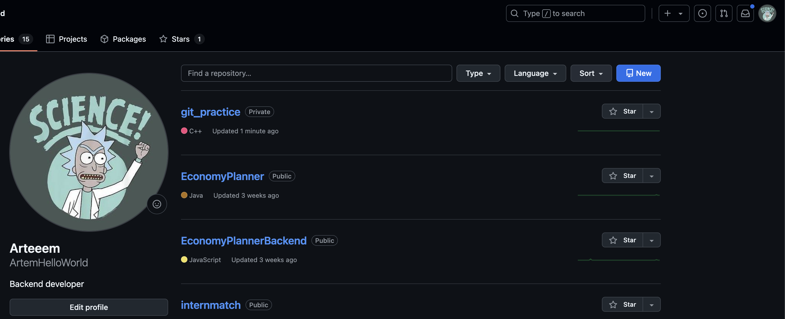

ну допустим назовем его git_practice. и оставим public - чтобы все имели к нему доступ

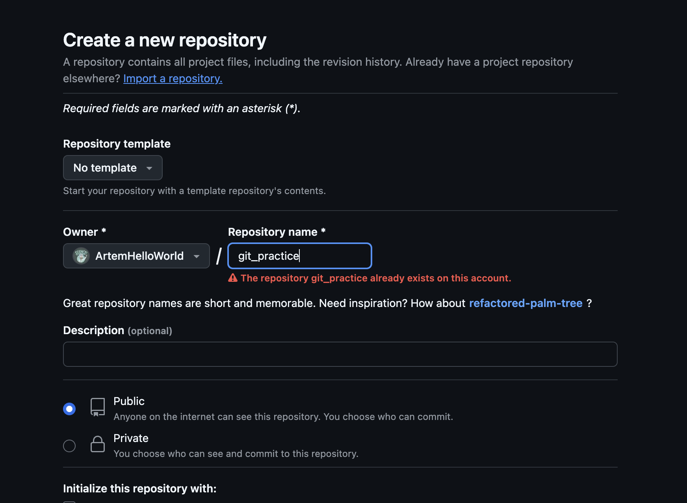

## 3

`git init`

`touch file.py`

`touch index.html`

`git add file.py index.html`

`git commit -m "Initial commit"`

`git branch -M main`

подставь сюда свой ник на githib и название репозитория из пункта 2

`git remote add origin https://github.com/ArtemHelloWorld/git_practice.git`

`git push -u origin main`

теперь все твои изменения и коммиты и ветки окажутся в общем доступе по ссылке https://github.com/ArtemHelloWorld/git_practice.git

## 5

`git branch test-branch` - создаем локально ветку

`git switch test-branch` - переключаемся туда

`touch style.css` - создаем файл

`git add style.css ` - добавляем в индекс

`git commit -m "Add styles"` - коммитим

теперь загрузим этот коммит в main 

для этого надо туда переключиться

`git switch main ` - возвращаемся

смотрим что тут нет нашего нового коммита

`git log`

`git merge test-branch` - переносим коммиты из test-branch в текущую ветку (main)

теперь коммит есть 

`git log`

!в задании нет этого но можно еще обновить удаленную ветку - чтобы не втыкала

`git push `

идем в гитхаб и видим новый файл

## 6

### 1
я не понял зачем опять клонировать... наверное нужно создать в гитхабе новый репозиторий и его склонировать локально... посмотрим команду 

`git clone https://github.com/ArtemHelloWorld/git_practice.git`

### 2

`git branch new`

`git branch`

### 3

`git switch new` - переключаемся туда

`touch file1.txt` - создаем файл

`git add file1.txt` - добавляем в индекс

`git commit -m "Add file1.txt"` - коммитим

`touch file2.txt` - создаем файл

`git add file2.txt` - добавляем в индекс

`git commit -m "Add file2.txt"` - коммитим

`touch file3.txt` - создаем файл

`git add file3.txt` - добавляем в индекс

`git commit -m "Add file3.txt"` - коммитим

### 4

`git push origin new` origin - значит удаленный , new - название ветки которую отправляем

теперь в гитхабе можно увидеть эту ветку и коммиты в этой ветке
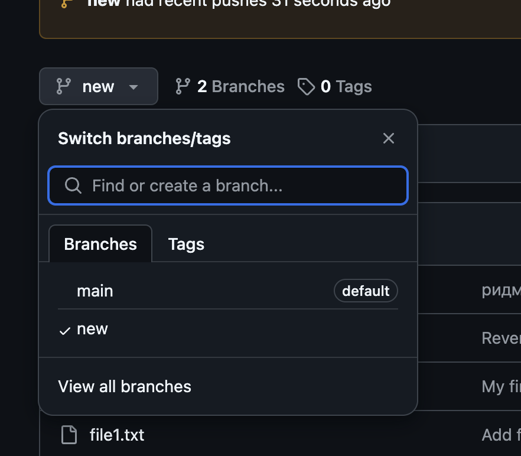

### 5

ну изменим файл который уже был до пункта 3. например file.py

### 6

Git stash — это команда, которая временно сохраняет изменения в рабочем каталоге, возвращая его состояние в соответствие с HEAD.  

1 из итуаций, когда используется git stash:
переключение веток для работы над другой задачей без фиксации незавершённой работы;

`git stash`

можно посмотерть все созданные stash

`git stash list`

### 7

`git switch main`

### 8

Команда git stash pop применяет самые свежие отложенные изменения и удаляет их из списка отложков. 

`git stash pop`

### 9

мы увидим что добавлены файлы из пункат 3

`git diff main new `

или

`git diff --name-status  main new`

--name-status выведет название файла и что с ним произошло добавлен/удален/изменен

### 10

`git merge new` 

# Часть 3

## 1

идем по ссылке и нажимаем fork - это скопировать репозиторий себе в аккаунт

https://github.com/airbnb/javascript

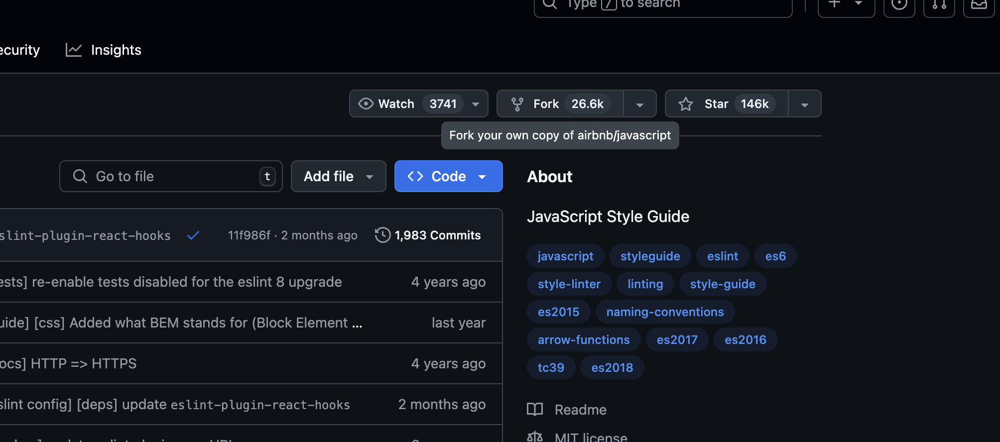

## 2

`git clone https://github.com/ArtemHelloWorld/airbnb_javascript.git`

## 3

`git branch branch1`

`git branch branch2`

## 4

`git switch branch1`

меняем README.md 

`git add README.md `

`git commit -m "change 1 readme"`

и еще два файла

## 5

`git merge branch1`

открываем файлы и решаем конфликты

смотрим какое изменение как называется (current / incoming) и принимаем нужное изменение - или оба

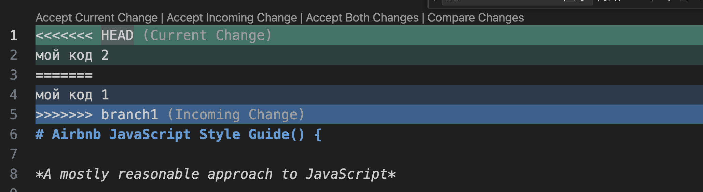

`git add README.md` 

`git commit -m "Resolved merge conflict"`

смотрим что теперь в ветке 2 есть коммиты и из первой и второй ветки

`git log`

## 6

`git push origin branch1`

`git push origin branch2`

## 7

делаем изменения 

`git switch branch1`

меняем README.md 

`git add README.md `

`git commit -m "change 1 readme"`

и еще два файла

## 8

airbnb_javascript1 - новая папка репозитория

`git clone https://github.com/ArtemHelloWorld/airbnb_javascript.git airbnb_javascript1`

## 9

`git switch branch1`

делаем изменения 

`git switch branch1`

меняем README.md 

`git add README.md `

`git commit -m "change 1 readme"`

и еще два файла

## 10

`git push origin branch1`

## 11

возвращаемся к истокам

`cd ../airbnb_javascript`

`git push origin branch1 --force`

идем в гитхаб и что же видим - коммита из нового репозитория нет. это произошло так как в сатром репозитории не было этого коммита и мы сделали force push (с силой). если бы мы не написали force то пуш бы не удался с ошибкой, что удаленный рппозиторий содежит изменнеия котрых нет локально, подскажет еще что возможно это из-за этого, что изменения были отправлены из другой ветки, и предложит решение для начала сделать git pull(стянуть изменения из удаленного репозитория чтобы локальный и удаленный репозитории были на одном уровне)

если сделать (для понимания)

`cd ../airbnb_javascript1`

`git push origin branch1 --force`

то увидим у адленном репозитории коммит из airbnb_javascript1, но не увдим из airbnb_javascript 

## 12

чтобы подтянуть изменения из веток нужно использовать pull

но простой пулл сейчас не получится потому что ветки разошлись в изменениях (Гит вам говорит, что история веток разошлась и нужно явно указать, каким методом сливать разные ветки при pull. Обычно принято использовать метод merge) чем отличается merge от rebase я еще не знаю поэтому советую почитать - https://habr.com/ru/articles/432420/ у меня это спрашивали на интервью (команду которая отклонила меня)

поэтому сделаем слияние merge добавив флаг --no-rebase

`git pull origin branch1 --no-rebase`

у нас возникнут кофликты - их нужно будет решить как в пункте 5

